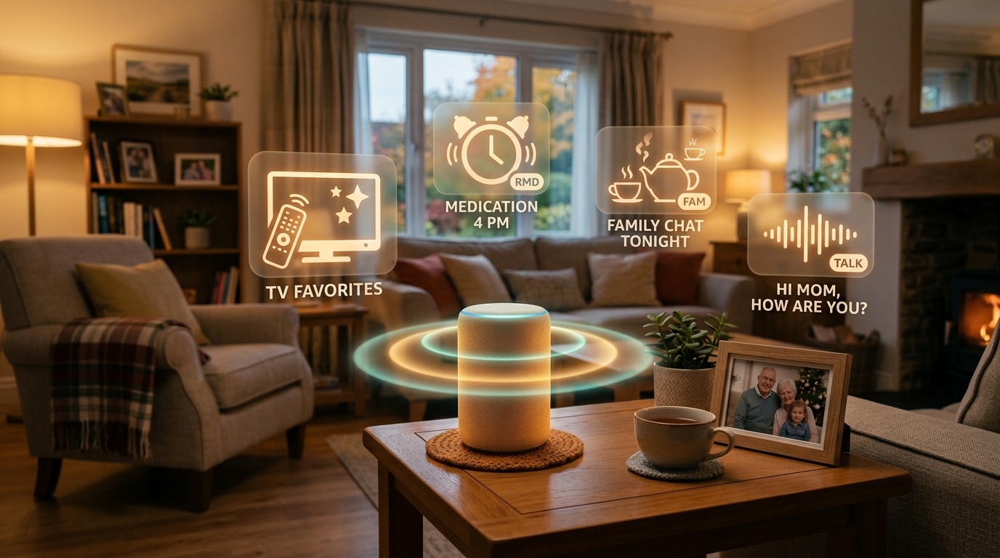
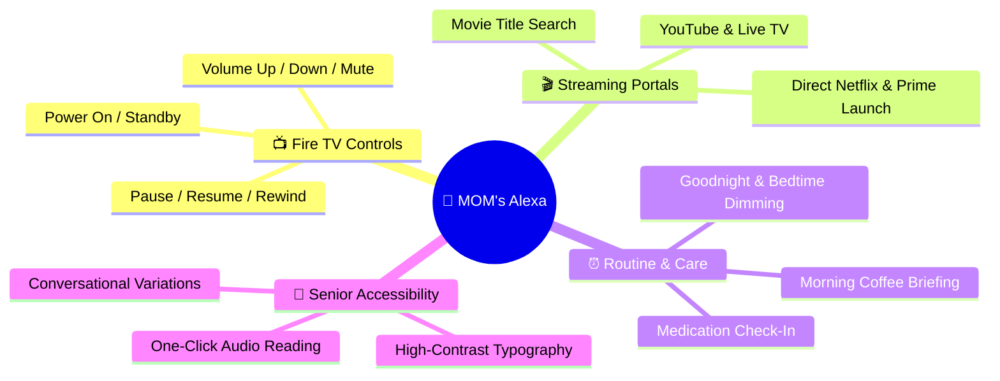
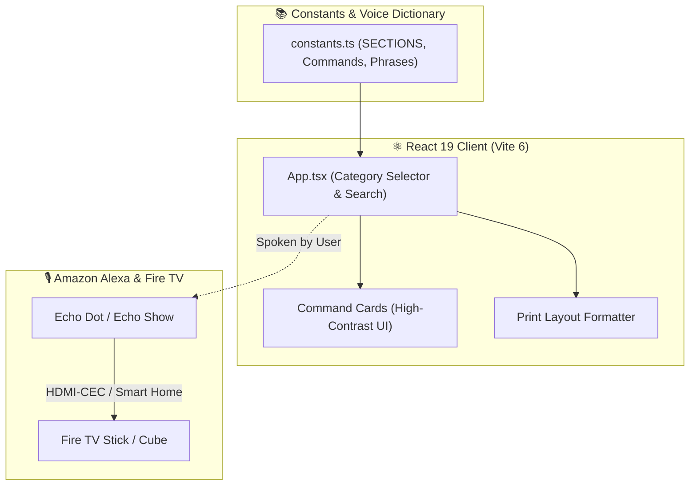

<!-- 👵 MOM'S AMAZON ALEXA — REPOSITORY PRESENTATION (L3 SHOWCASE) -->

<div align="center">



# **👵 MOM's Amazon Alexa**

**An accessible, senior-friendly voice command dashboard, Fire TV controller guide, and daily routine assistant built with React 19, TypeScript, and Tailwind CSS.**

[](#-voice-categories)
[](package.json)
[](tsconfig.json)
[](vite.config.ts)
[](#-senior-first-design)
[](LICENSE)
[](https://github.com/traikdude/MOMs-Amazon-Alexa)

<p align="center">
  <a href="#-overview"><b>Overview</b></a> •
  <a href="#-core-features"><b>Features</b></a> •
  <a href="#-voice-categories"><b>Categories</b></a> •
  <a href="#-senior-first-design"><b>Accessibility</b></a> •
  <a href="#-architecture"><b>Architecture</b></a> •
  <a href="#-quick-start--local-development"><b>Quick Start</b></a> •
  <a href="#-contributing"><b>Contributing</b></a> •
  <a href="#-license"><b>License</b></a>
</p>

</div>

---

## 📑 Table of Contents

- [✨ Overview](#-overview)
- [🚀 Core Features](#-core-features)
  - [1. Senior-Optimized Natural Phrasing](#1-senior-optimized-natural-phrasing)
  - [2. Fire TV & Streaming Navigation](#2-fire-tv--streaming-navigation)
  - [3. Daily Routine & Health Reminders](#3-daily-routine--health-reminders)
  - [4. High-Contrast Accessible Interface](#4-high-contrast-accessible-interface)
  - [5. Printable Reference Guides](#5-printable-reference-guides)
- [🎙️ Voice Command Categories](#-voice-command-categories)
- [💖 Senior-First Design Principles](#-senior-first-design-principles)
- [🏗️ Architecture & Component Flow](#-architecture--component-flow)
- [🛠️ Tech Stack](#-tech-stack)
- [⚡ Quick Start & Local Development](#-quick-start--local-development)
- [🗂️ Repository Structure](#-repository-structure)
- [🤝 Contributing](#-contributing)
- [📄 License](#-license)

---

## ✨ Overview

**MOM's Amazon Alexa** is an empathetic voice assistant companion and visual reference studio designed to bridge the technology gap for elders, parents, and seniors.

Built with **React 19** and **TypeScript**, the platform catalogs over 70 native Alexa commands and custom voice routines categorized into intuitive everyday actions (TV controls, channel launching, volume adjustment, bedtime routines, medication reminders, and family communication). Every command is annotated with senior-intuitive phrasing options that match natural conversational speech patterns rather than robotic keyword syntax.

---

## 🚀 Core Features



### 1. Senior-Optimized Natural Phrasing
Includes dozens of conversational alternatives (e.g. *"Alexa, wake up the TV"*, *"Alexa, wait a minute"*, *"Alexa, hold on"*) mapped to reliable Alexa routines.

### 2. Fire TV & Streaming Navigation
Direct voice shortcuts to switch inputs, launch Netflix/Prime/YouTube, search for specific movies, or adjust volume without hunting for tiny remote buttons.

### 3. Daily Routine & Health Reminders
Preset routines for morning weather/news broadcasts, hydration and medication reminders, and evening light dimming.

### 4. High-Contrast Accessible Interface
Large readable fonts, color-coded section badges, clear iconography, and zero visual clutter for easy tablet and desktop browsing.

### 5. Printable Reference Guides
Clean print-friendly layouts that can be printed as a physical kitchen or nightstand cheat sheet.

---

## 🎙️ Voice Command Categories

| Section | Domain | Sample Senior-Friendly Phrase |
|---|---|---|
| 📺 **TV General** | Power, Playback, Volume | *"Alexa, wake up the TV"* / *"Alexa, freeze the TV"* |
| 🎬 **Streaming Channels** | Netflix, Prime, YouTube | *"Alexa, put on Netflix"* / *"Alexa, open my movies"* |
| 🔊 **Audio & Volume** | Volume steps, Mute, Quiet mode | *"Alexa, make it louder"* / *"Alexa, hush the TV"* |
| ⏰ **Care & Reminders** | Medication, Tea time, Check-ins | *"Alexa, remind me to take afternoon pills at 4 PM"* |
| 🌙 **Night & Morning** | Lighting scenes, Sleep timers | *"Alexa, goodnight Mom"* (Turns off TV, dims lights) |

---

## 💖 Senior-First Design Principles

* **Forgiving Voice Recognition**: Accommodates hesitations, pauses, and colloquial phrasing.
* **Zero Technical Jargon**: Replaces terms like "Input HDMI 2" with "Switch to Cable TV".
* **Visual Reassurance**: Clear status indicators showing whether a phrase is a native Alexa command or requires a custom Alexa Routine.

---

## 🏗️ Architecture & Component Flow



---

## 🛠️ Tech Stack

* **Frontend Framework**: React 19 (`react` 19.0.0, `react-dom` 19.0.0)
* **Language & Typing**: TypeScript 5.8.2 (`tsconfig.json`)
* **Build System**: Vite 6.2.0 (`vite.config.ts`)
* **Styling**: Tailwind CSS with warm, high-contrast accessible palettes
* **Iconography**: Lucide React (`lucide-react` 0.546.0)

---

## ⚡ Quick Start & Local Development

### Prerequisites
* [Node.js](https://nodejs.org/) (v18+ or v20+)
* `npm` or `pnpm`

### Setup Instructions
1. Clone the repository:
   ```bash
   git clone https://github.com/traikdude/MOMs-Amazon-Alexa.git
   cd MOMs-Amazon-Alexa
   ```
2. Install dependencies:
   ```bash
   npm install
   ```
3. Start the local Vite server:
   ```bash
   npm run dev
   ```
4. Open `http://localhost:3000` in your browser.

---

## 🗂️ Repository Structure

```text
MOMs-Amazon-Alexa/
├── docs/                        # Presentation & visual assets
│   └── assets/
│       └── banner.png           # L3 Showcase high-resolution hero banner
├── src/
│   ├── App.tsx                  # 40KB+ Accessible command browser & filter
│   ├── constants.ts             # 37KB+ Voice command dictionary & senior phrases
│   ├── index.css                # Accessible styling & print stylesheet
│   └── main.tsx                 # React 19 DOM entrypoint
├── package.json                 # Project dependencies & scripts
├── tsconfig.json                # TypeScript compiler configuration
├── vite.config.ts               # Vite bundler configuration
├── README.md                    # L3 Showcase presentation documentation
└── LICENSE                      # MIT Open Source License
```

---

## 🤝 Contributing

1. Fork the repository and create your branch (`git checkout -b feature/new-senior-phrase`).
2. Add new phrases or routine mappings in `src/constants.ts`.
3. Verify that the build succeeds: `npm run build`.
4. Submit a Pull Request.

---

## 📄 License

Distributed under the **MIT License**. See [LICENSE](LICENSE) for details.

---

<div align="center">

*Dedicated to Family Care, Accessible Technology & Senior Independence.*  
**MOM's Amazon Alexa · React 19 · TypeScript · Accessible Voice UI**

</div>
